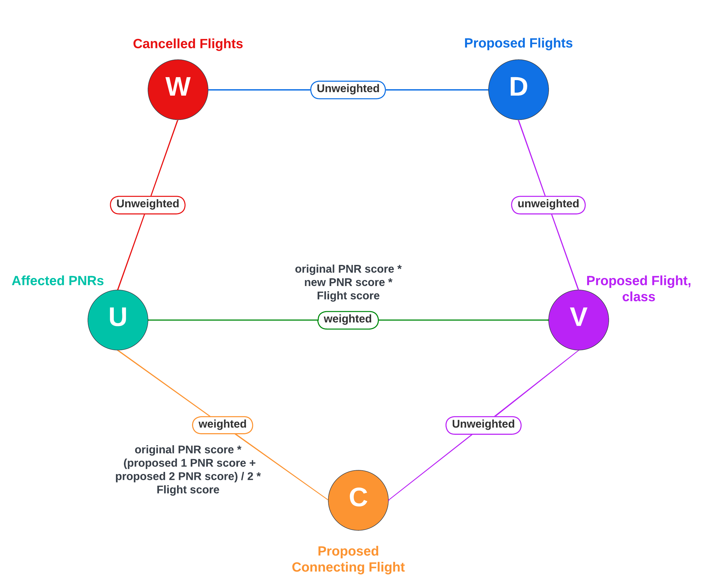
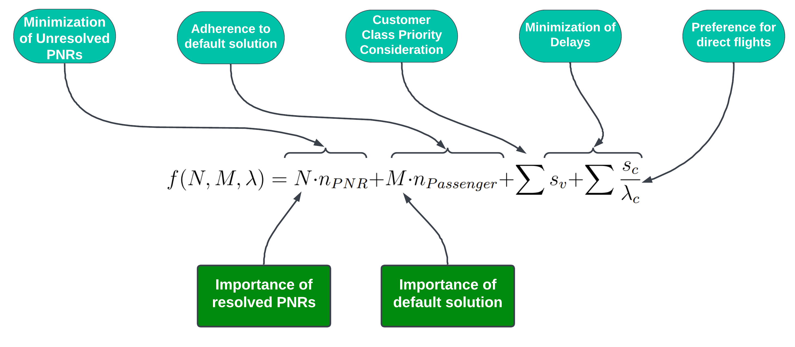
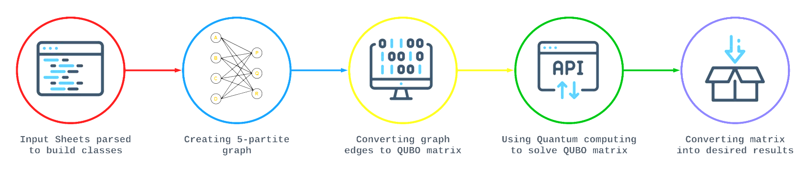

<h1 align = "center"> Passenger Re-accommodation for a planned Schedule Change </h1>

 

**This repository serves as the official submission of Team 65 for the Mphasis Problem Statement.**

<h2 id="content"> 📝 Contents </h2>

 1. [Problem Statement](#problem)
 2. [Proposed Solution](#solution)
 3. [Analysis](#Analysis)
 4. [Usage Instructions](#usage)

<h2 id="problem"> 🌟 Problem Statement </h2>

Airlines frequently adjust flight schedules, impacting passengers who need to be re-accommodated on alternative flights. This project aims to automate the analysis of schedule changes, identify affected flights and passengers, and provide optimal re-accommodation solutions.

We need to develop a system to identify and rank optimal alternate flight solutions for passengers affected by planned schedule changes.Additionally, we  need to utilize provided rule sets to ensure solution validity, considering factors like time, ancillary services impact, and passenger priority based on cabin and loyalty.

Our objectives are to:

1. Identify impacted flights and passengers.
1. Optimize alternate flight selection based on time, ancillary services impact, etc.
1. Prioritize passenger re-accommodation based on factors like passenger cabin and loyalty.
1. Allow flexibility to customize business rules for flight and passenger ranking.
1. Generate and rank re-accommodation solutions for airlines to choose from.
1. Implement expiration date and time for solutions.

:point_right: Click <a href="https://drive.google.com/file/d/1Ppkx6Iz7R2zpg1qSGHCDRIupKZ-0LBpM/view">here</a> to get the detailed problem statement. 

<h2 id="solution"> :brain: Proposed Solution </h2>

We can streamline our problem-solving approach by reducing the complexity in the following manner.

## Problem Reduced to Graph Representation

 

Here,
- $W$ represents set of nodes denoting cancelled flights.
- $U$ represents set of nodes denoting affected PNRs.
- $D$ represents set of nodes denoting proposed flights.
- $V$ represents set of nodes denoting direct proposed flight with class.
- $C$ represents set of nodes denoting connected proposed flight with class.

## Deduced Constraints :

1. At most one alternative flight solution is selected for each passenger in U, representing all impacted PNR(s) which ensures an effective reallocation of alternate flights for every affected passenger. Here $x_{u,v}$ and $x_{u,c}$ are boolean representations of existence of edge in $(U, V)$ and $(U, C)$ respectively.

2. It is imperative to ensure that seat allocations do not exceed the available number of seats, maintaining a meticulous alignment between the number of seats allocated and the actual capacity.

3. Let D denote the set comprising all proposed flights for rescheduling, and W represent the set of cancelled flights. We must ensure that each cancelled flight, residing within set W, be exclusively assigned to a single new rescheduled flight from the set D.

## Proposed Scoring Function

The proposed scoring function for Optimization is shown above :

where,
- $n_{PNR}$ = Number of PNR reallocated
- $n_{Passengers}$ = Number of Passengers allocated through the default solution
- $s_v$ = Score of Edges selected in (U, V)
- $s_c$ = Score of Edges selected in (U, C).
- $\lambda_c$ = Number of Flights in C.

Here, $N$, $M$ are scaling factors for each individual property used to quantify its priority.

## Reduction To QUBO
The key steps are:

1. **Transform the Constraint Inequality:**

    Transform the inequality \(Ax \leq b\) by dividing both sides by a user-defined integer \(\rho > 0\) to get:
    \[
    \frac{Ax}{\rho} \leq \frac{b}{\rho}
    \]

2. **Approximate the Right Hand Side:**

    Approximate the right-hand side \(\frac{b}{\rho}\) using a single slack variable \(s_1\). Formulate as equality constraint: \(A_{\text{mod}} x = s_1\). This reduces the number of slack variables from \(O(\log(s_1+1))\) to just 1.

3. **Binary Expand Slack Variable**

    Apply binary expansion to represent integer slack variables as binaries. This increases the number of slack variables to \(O(\log(b+1))\) but note that these are binary variables.

4. **Adjust the Penalty Coefficient:**

    Adjust the penalty coefficient \(M\) to \(M' = \rho^2 \cdot M\) to account for the transformation. This maintains a similar penalty scale.

5. **Construct QUBO**

    Construct QUBO: \(Q_{\text{qubo}} = Q + \text{penalty}(A_{\text{mod}} x - b)^2\)

## Using Quantum Computing to Solve QUBO

Quadratic Unconstrained Binary Optimization (QUBO) serves as a mathematical framework for binary optimization, with the primary goal of minimizing or maximizing a quadratic objective function.
To leverage quantum computing for solving QUBO matrices, quantum annealing is employed—an approach that begins in a higher-energy state,and thereafter keeps transitioning to lower energy states, thus enabling the system to find optimal solutions. This process is facilitated through the utilization of the Ising model, which transforms QUBO problems into the Ising Hamiltonian.

D-Wave Systems, a pioneer in quantum computing, offers D-Wave Leap—a cloud-based service providing remote access to quantum processors. The Leap Hybrid Solver, a feature of D-Wave Leap, seamlessly integrates classical and quantum processing. By leveraging D-Wave's quantum processing unit (QPU) in conjunction with classical computing, it offers an effective solution for addressing complex optimization problems.

Adiabatic quantum computing, a broader approach encompassing quantum annealing, relies on the adiabatic theorem to ensure that a quantum system remains in its ground state during a slow evolution between initial and final Hamiltonians.

This comprehensive approach enables efficient problem-solving by concurrently exploring various possibilities.

<h2 id="solution"> :iphone: Analysis </h2>

<h2 id="usage"> 📋 Workflow </h2>

  

<h2 id="usage"> 📋 Usage Instructions </h2>

Refer to the "Makefile" for specific commands on how to run the program:

- `excel-to-csv` Converts given excel files into csv format.
- `csv-to-graph` Parses the csv files and creates our resulting 5 partite graph.
- `graph-to-qubo` Formulates graph constraint into a QUBO matrix  
- `qubo-to-binary` Solves the QUBO using an API to call D-Wave's cloud-based quantum computers
- `edges-to-txt` Converts resulting QUBO solution into the resulting flight assignment for affected passengers
- `txt-to-excel` Creates output excel files giving reassigned flights for affected passengers, along with flight solution statistics

  To run entire code do the following:
- `make-install` Used to install requirements
- `make-run` Used to execute the complete workflow in order 

<h2 id="usage"> ✨ Contributors </h2>

- **Kushagra Khare - Team Lead**
- **Akshat Rampuria - Team Vice Lead**
- **Sarthak Gupta**
- **Arihant Garg**
- **Thatparthi Ajay Reddy**
- **Shreyan Bagchi**
